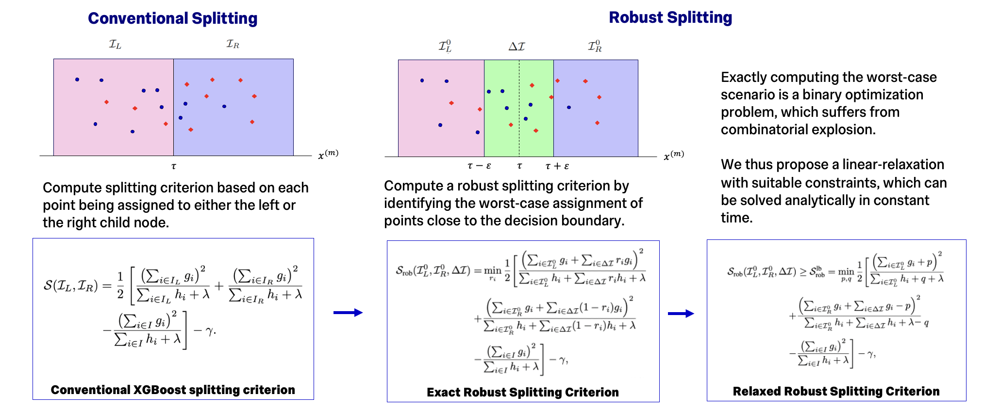

# Learning Robust XGBoost Ensembles for Regression Tasks

This repository contains a mini-package and experiments for the 
paper ["Learning Robust XGBoost Ensembles for Regression Tasks"](https://proceedings.mlr.press/v286/sharma25a.html) 
presented at UAI 2025.

We propose a novel algorithm to train robust XGBoost ensembles, 
through a modification of the robust splitting criterion. Our proposed 
formulation is generalisable across various use-cases and efficient. 



## Installation

We highly recommend using the [UV package manager](https://docs.astral.sh/uv/). 

```bash
# Clone the repository
git clone https://github.com/SafeIntelligence/robust_xgboost_ensembles.git
cd robust_xgboost_ensembles

# Create virtual environment
uv venv robxgb --python=3.11

# Activate environment
source robxgb/bin/activate

# Install in editable mode
uv pip install -e ".[dev]"
```

## Quick Start

Here's a complete example showing how to use our robust XGBoost implementation with a realistic dataset:

```python
import numpy as np
from sklearn.datasets import fetch_openml
from sklearn.model_selection import train_test_split
from sklearn.preprocessing import MinMaxScaler
from sklearn.metrics import mean_squared_error, r2_score

from robust_xgboost.models.ensembles.xgboost_regressor import XGBoostRegressor

# Load a real dataset (Boston Housing from OpenML)
data = fetch_openml(name="boston", version=1, as_frame=True)
X, y = data.data.values, data.target.values

# Normalize features
X = MinMaxScaler().fit_transform(X)

# Split the data
X_train, X_test, y_train, y_test = train_test_split(
    X, y, test_size=0.2, random_state=42
)

# Train our robust XGBoost model
robust_model = XGBoostRegressor(
    n_base_models=50,           # Number of trees
    max_depth=6,                # Maximum tree depth
    learning_rate=0.1,          # Learning rate
    pert_radius=0.05,           # Perturbation radius for robustness
)

robust_model.fit(X_train, y_train)

# Make predictions
robust_predictions = robust_model.predict(X_test)

# Evaluate both models
print("Robust XGBoost:")
print(f"  MSE: {mean_squared_error(y_test, robust_predictions):.4f}")
print(f"  R²:  {r2_score(y_test, robust_predictions):.4f}")

# Save the robust model
robust_model.save_model("robust_xgboost_model.json")
```

## Reproducing Paper Results

To reproduce the experimental results reported in our UAI 2025 paper, you can run the provided experiment scripts on an OpenML benchmark suite curated by [Grinsztajn et. al. 2022](https://papers.neurips.cc/paper_files/paper/2022/file/0378c7692da36807bdec87ab043cdadc-Paper-Datasets_and_Benchmarks.pdf) for regression tasks. The MILP solver used to obtain the robustness metrics relies on the 
[Gurobi](https://www.gurobi.com) package, that requires a suitable academic or industrial license.

Please note that if you would like to run experiments for the `R-GBDT` method, it
must be built from the instructions listed in the library from the paper ([Robust Decision Trees Against Adversarial Examples](https://github.com/chenhongge/RobustTrees)). The resulting executable (called `xgboost`) must be placed at the following path: 

```bash
robust_xgboost_ensembles/robust_xgboost/baseline_interfaces/xgboost
```

The following scripts can be used to run the experiments described in the paper: 

```bash
# Run experiments with default perturbation radius (ε = 0.05)
python robust_xgboost/experiments/run_regression_experiments.py --eps 0.05

# Run experiments with different perturbation radii
python robust_xgboost/experiments/run_regression_experiments.py --eps 0.01
python robust_xgboost/experiments/run_regression_experiments.py --eps 0.1
```


## License

This project is licensed under the AGPL-3 License - see the [LICENSE](LICENSE) file for details.

## Citation

If you use this robust XGBoost implementation in your research, please cite our UAI 2025 paper:

```bibtex
@inproceedings{sharma2025robxgb,
  title={Learning Robust XGBoost Ensembles for Regression Tasks},
  author={A.~V.~Sharma and P.~Kouvaros and A.~Lomuscio},
  booktitle={Proceedings of the 41st Conference on Uncertainty in Artificial Intelligence (UAI)},
  year={2025},
  publisher={PMLR},
  url={https://proceedings.mlr.press/v286/sharma25a.html}
}
